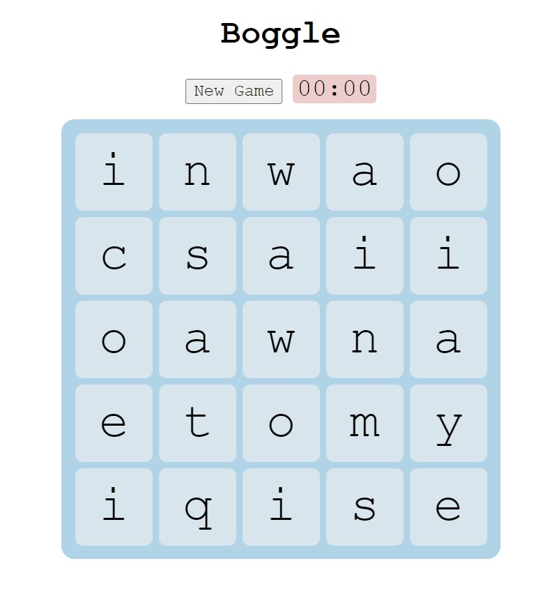

# A Server Used for Playing Boggle

Hosted on AWS, using socket.io for game updates (very simple implementation, the only game update is a new game)
Socket.io rooms are used to manage the different urls that can be played at

